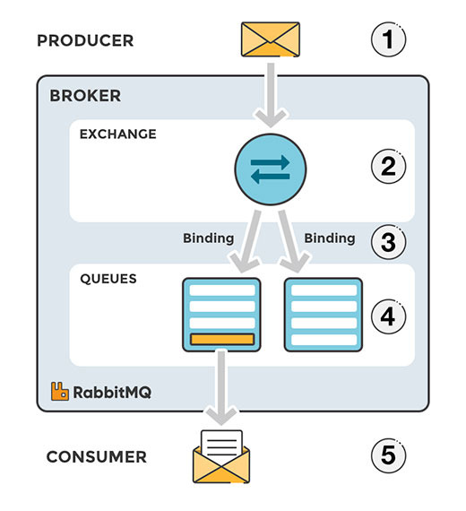

# RabbitMQ

## RabbitMQ의 정의와 등장 배경

### 1. RabbitMQ란 무엇인가

RabbitMQ는 AMQP(Advanced Message Queuing Protocol)를 구현하여 메시지 생성자와 소비자 사이에서 메시지를 중계해 주는 메시지 브로커입니다. 여기서 AMQP란 메시지 지향 미들웨어를 위한 개방형 표준 응용 계층 프로토콜을 의미합니다. RabbitMQ는 메시지 지향 미들웨어(MOM)에 속하며, 비동기 메시지를 사용하는 응용 프로그램들 사이에서 데이터를 송수신하는 시스템인 메시지 큐를 구현한 솔루션입니다.

### 2. RabbitMQ가 등장한 이유

웹 서비스가 확장되고 분산 시스템으로 발전하면서 기존 방식의 문제점을 해결하기 위해 등장했습니다.

- 동기 처리 구조의 한계: 과거에는 하나의 요청 안에서 이메일 전송, 로그 기록, 통계 반영 등 모든 작업을 동기적으로 처리했습니다. 이로 인해 하나의 작업만 지연되어도 전체 응답이 느려지고 외부 시스템의 장애가 전체 서비스로 전파되는 문제가 발생했습니다.
- 서비스 간 강한 결합: 서비스들이 직접 호출하는 구조에서는 의존성이 강해져 하나의 서비스 변경이 전체 시스템에 영향을 주었습니다.
- 기존 메시지 큐의 한계: 초기 메시지 큐는 단순한 FIFO 방식에 머물러 메시지 분배나 다중 전달 기능이 부족했습니다. RabbitMQ는 이를 해결하기 위해 Exchange라는 중간 계층을 도입하여 유연한 라우팅을 가능하게 했습니다.

## 메시지 큐 사용의 이점

1. 비동기(Asynchronous): 메시지를 큐에 넣어두고 나중에 처리할 수 있어 동기화 방식에서 발생하는 병목 현상을 방지합니다.
2. 낮은 결합도(Decoupling): 생산자(Producer)와 소비자(Consumer)가 독립적으로 행동하여 서비스 간 의존성이 낮아집니다.
3. 확장성(Scalable): 다수의 프로세스가 메시지 큐를 통해 메시지를 보낼 수 있어 분산 처리에 최적화되어 있습니다.
4. 탄력성(Resilience): 소비자 서비스가 중단되어도 메시지는 큐에 남아있으므로, 서비스 재시작 시 다시 처리할 수 있습니다.
5. 보장성(Guarantees): 보관된 모든 메시지가 결국 소비자에게 전달된다는 일반적인 보장을 제공합니다.

## RabbitMQ의 구조와 구성 요소

1. Producer: 메시지를 생성하고 발송하는 주체입니다. 메시지를 큐에 직접 보내지 않고 Exchange에 게시합니다.
2. Consumer: 메시지를 받아와서 처리하는 주체입니다.
3. Exchange: Producer로부터 받은 메시지를 어떤 큐에 보낼지 결정하는 객체입니다. 4가지 타입이 있으며 바인딩 규칙에 따라 메시지를 전달합니다.
4. Binding: Exchange와 Queue를 연결하는 관계입니다.
5. Queue: 메시지를 일시적으로 저장하는 장소입니다. 호스트의 디스크 용량 및 메모리에 제한을 받으며, 소비자가 메시지를 읽어가면 기본적으로 큐에서 삭제됩니다.



## Exchange 타입 상세 설명

### 1. Direct Exchange

Direct Exchange는 메시지에 담긴 라우팅 키와 큐를 생성할 때 설정한 바인딩 키가  정확히 일치할 때 메시지를 전달하는 방식입니다. 가장 기본적이면서도 명확한 라우팅 방법입니다.

동작 방식을 자세히 보면 생산자가 메시지를 보낼 때 특정 목적지 이름을 적어 보내는 것과 같습니다. 예를 들어 라우팅 키를 에러로 설정해서 보내면, 에러라는 이름으로 연결된 큐에만 메시지가 들어갑니다. 하나의 큐에 여러 개의 키를 연결할 수도 있고, 반대로 여러 개의 큐에 동일한 키를 연결해서 같은 메시지가 여러 곳으로 복사되게 할 수도 있습니다. 이름이 없는 기본 익스체인지 역시 이 방식을 따르며, 큐를 만들 때 부여한 이름이 곧 라우팅 키가 되어 자동으로 연결됩니다.


### 2. Topic Exchange

Topic Exchange는 라우팅 키의 전체가 아니라 특정 패턴이 일치하는 큐들에게 메시지를 보내는 방식입니다. 여러 조건을 조합해서 메시지를 분류해야 할 때 유용합니다.

이 방식에서는 라우팅 키를 점으로 구분된 단어 형태로 만듭니다. 이때 두 가지 특수 기호를 사용해 패턴을 정의합니다. 별표(*) 기호는 단어 딱 하나가 그 자리에 있어야 함을 의미합니다. 우물 정(#) 기호는 단어가 없거나 혹은 여러 개가 있어도 상관없다는 의미입니다. 

큐1: *.black.*\* *(세 단어 중 가운데가 black이면 수신)
큐2: \*.*.cat (세 단어 중 마지막이 cat이면 수신)
큐2: lazy.# (시작이 lazy이면 뒤에 뭐가 오든 수신)


### 3. Headers Exchange

Headers Exchange는 라우팅 키 문자열을 사용하지 않습니다. 대신 메시지의 헤더 부분에 포함된 여러 가지 속성 값들을 비교해서 라우팅 여부를 결정합니다.

바인딩을 설정할 때 큐는 자신이 받고 싶은 헤더 조건들을 익스체인지에 등록합니다. 메시지가 들어오면 익스체인지는 그 메시지의 헤더 정보와 큐가 등록한 조건을 대조합니다. 이때 x-match라는 옵션을 통해 판정 기준을 정할 수 있습니다. x-match = all 이면 등록된 모든 헤더 조건이 메시지와 완벽히 일치해야 메시지를 전달합니다. 반면 x-match = any 라면 등록된 조건 중 하나만 일치해도 메시지를 전달합니다. 

### 4. Fanout Exchange

Fanout Exchange는 라우팅 키나 패턴, 헤더 조건 등을 전혀 따지지 않습니다. 해당 익스체인지에 연결되어 있는 모든 큐에 메시지를 복제해서 무조건 전달하는 방식입니다.

## 메시지 분배 및 신뢰성 관리

### Round-Robin과 Fair Dispatch

만약 하나의 Queue에 여러 개의 Consumer가 붙어있다면 RabbitMQ에서는 Round-Robin 방식을 통해 Consumer에게 메시지를 균등하게 분배합니다.

하지만 Round-Robin 방식이 무조건 효율적이지 않습니다.

예를 들어 하나의 Queue에 두 개의 Consumer가 존재하고, 이 두 개의 Consumer에는 Round-Robin 방식으로 메시지가 분배됩니다.

이때, 만약 홀수 번째의 메시지는 처리 시간이 매우 길고 짝수 번째 메시지는 처리 시간이 짧은 경우, 홀수 번째 메시지를 처리하는 Consumer에는 처리해야 할 메시지가 계속 누적되는 경우가 발생할 수 있는데요. (Round-Robin의 경우 시간순으로 처리하기 때문)

이러한 상황을 예방하기 위해서 RabbitMQ에서는 'Prefetch'를 설정할 수 있습니다.

Prefetch는 Queue의 메시지를 Consumer의 메모리에 쌓아둘 수 있는 최대 메시지의 양으로 Prefetch Count의 값을 1로 설정하면 하나의 메시지가 처리되기 전에는 새로운 메시지를 받지 않기 때문에 작업을 분산시킬 수 있습니다.


### 메시지 유실 방지 메커니즘

- Ack / Nack 
소비자가 메시지를 전달받았다고 해서 브로커가 바로 지우지 않습니다. 소비자가 로직을 끝내고 잘 처리했다는 신호인 Ack를 보내야만 삭제합니다. 만약 처리를 완료하기 전에 소비자 서버가 꺼지거나 연결이 끊겨서 Ack가 오지 않으면, 브로커는 이 메시지를 다시 큐에 대기 상태로 되돌립니다. 덕분에 다른 소비자가 해당 메시지를 이어받아 처리할 수 있어 작업이 유실되지 않습니다.
- 영속성 (Persistence)
브로커 서버 자체가 재시작되거나 장애가 발생했을 때 데이터가 사라지는 것을 막는 장치입니다. 큐를 생성할 때 듀러블로 설정하면 큐라는 보관함 자체가 유지되고, 메시지를 보낼 때 퍼시스턴트 옵션을 주면 메시지 내용이 디스크에 물리적으로 기록됩니다. 이 두 설정이 함께 되어 있어야 서버가 다시 켜졌을 때 큐와 그 안의 메시지들을 그대로 복구할 수 있습니다.
- Publisher Confirm
생산자가 메시지를 보낸 후 브로커에 안전하게 도착했는지 확인받는 절차입니다. 생산자가 메시지를 게시하면 브로커는 이를 수신하고 디스크 기록 등의 처리를 마친 뒤 잘 받았다는 확인 응답을 다시 생산자에게 보냅니다. 만약 네트워크 문제로 메시지가 도중에 사라져서 응답이 오지 않는다면 생산자는 전송 실패를 인지하고 다시 보내는 등의 대응을 할 수 있습니다.

### RabbitMQ가 특히 잘 맞는 시나리오와 그 이유

메시지의 신뢰성과 정확한 전달이 최우선인 비즈니스 로직에 가장 적합합니다. 인스타그램이나 올리브영 사례처럼 사용자에게 직접 전달되는 알림이나 쿠폰 발급처럼 누락이 발생해서는 안 되는 작업이 여기에 해당합니다. RabbitMQ는 소비자가 처리를 완료했다는 신호를 보낼 때까지 메시지를 보관하는 확인 응답 메커니즘을 갖추고 있어, 시스템 장애 상황에서도 메시지 지속성을 관리하기에 매우 유리합니다. 또한 트래픽이 급증하는 순간에 큐가 완충 작용을 시스템의 부하를 조절하는 트래픽 완화 시나리오에도 최적입니다.

인스타그램의 활용 사례

인스타그램은 서비스 간의 결합도를 낮추고 알림 작업의 신뢰성을 확보하기 위해 RabbitMQ를 사용합니다. 장고 기반의 서비스가 좋아요 요청을 처리하고 그 결과를 큐에 던지면, 셀러리 워커가 이를 가져가 알림을 발송합니다. 이 과정에서 확인 응답 기능을 활용해 알림 발송 누락을 원천 차단합니다. 단순히 메시지를 전달하는 것을 넘어 시스템 장애 시에도 메시지가 유실되지 않도록 관리하는 것이 핵심 목적입니다.


올리브영의 활용 사례

올리브영은 기존의 복잡한 비동기 쿠폰 발급 시스템을 RabbitMQ로 교체했습니다. 쿠폰 발급 요청을 큐에 적재하고 여러 대의 워커를 등록해 분산 처리함으로써 시스템 구조를 단순화했습니다. 특히 라우팅 기능을 활용해 복잡한 비즈니스 로직을 효율적으로 처리하며, 기존의 복잡한 발행 구독 모델을 더 명확하고 관리하기 쉬운 워커 큐 시스템으로 전환하여 운영 효율을 높였습니다.


### RabbitMQ가 적합하지 않은 시나리오

초당 수백만 건 이상의 대용량 로그 데이터를 실시간으로 수집하고 분석해야 하는 파이프라인에는 적합하지 않습니다. RabbitMQ는 메시지가 처리되면 즉시 삭제되는 구조라 데이터를 쌓아두고 반복해서 분석하기 어렵기 때문입니다. 또한 극도로 단순한 구조에서 지연 시간을 최소화해야 하는 단순 캐시성 작업의 경우, 레디스를 활용한 방식보다 오버헤드가 클 수 있습니다. 대규모 클러스터 운영 시 관리 복잡도가 증가하는 지점도 고려해야 합니다.

### 다른 MQ대신 선택하는 이유

가장 큰 결정 요인은 운영 비용 대비 얻을 수 있는 라우팅의 유연성과 신뢰성입니다. 인프라 의존성 측면에서 AMQP라는 표준 프로토콜을 사용하므로 다양한 개발 환경에서 도입하기 쉽습니다. 지연 시간은 레디스보다 조금 길고 처리량은 카프카보다 낮을 수 있지만, 메시지가 목적지에 정확히 도달했는지 확인하는 기능이 강력합니다. 올리브영의 사례처럼 복잡했던 기존 방식을 단순한 워커 큐 구조로 대체하면서도, 일련번호 기반 라우팅 같은 정교한 제어가 필요할 때 RabbitMQ가 최선의 선택지가 됩니다.

---

## 사용 방법

### 1. 프로젝트 구성

Spring Initializr를 통해 프로젝트를 생성할 때 Spring 위해 Spring RabbitMQ 의존성을 추가합니다.

설정 파일 (application.yml)
튜토리얼 실행을 위한 기본 프로필과 로그 레벨을 설정합니다.

```jsx
spring:
	profiles:
		active: usage_message

logging:
	level:
		org: ERROR

tutorial:
	client:
		duration: 10000
```

### 2. 자바 설정 (Configuration)

메시지 브로커와 통신하기 위해 사용할 큐와 빈을 정의합니다.

```jsx
// Tut1Config.java
@Configuration
public class Tut1Config {
	@Bean
	public Queue hello() {
	    return QueueBuilder.durable("hello").quorum().build();
	}   // durable 옵션으로 서버가 꺼져도 큐가 유지되게 하고 quorum 설정으로 고가용성을 확보

	@Profile("receiver")
	@Bean
	public Tut1Receiver receiver() {
	    return new Tut1Receiver();
	}

	@Profile("sender")
	@Bean
	public Tut1Sender sender() {
	    return new Tut1Sender();
	}

}
```

---

### 3. 메시지 보내기 (Producer)

RabbitTemplate을 사용하여 매우 간단하게 메시지를 보낼 수 있습니다. @Scheduled를 통해 주기적으로 메시지를 발행하는 예제입니다.

```jsx
// Tut1Sender.java
@RequiredArgumentConstructor
public class Tut1Sender {
	
	private final RabbitTemplate template;
	private final Queue queue;
	
	@Scheduled(fixedDelay = 1000, initialDelay = 500)  //애플리케이션이 실행된 후 0.5초 뒤에 시작하여 1초마다 반복적으로 send 실행
	public void send() {
	    String message = "Hello World!";
	    this.template.convertAndSend(queue.getName(), message); // 큐의 이름, 보낼 내용을 RabbitMQ로 전송
	    System.out.println(" [x] Sent '" + message + "'");
	}

}
```

---

### 4. 메시지 받기 (Consumer)

@RabbitListener 어노테이션을 사용하면 큐를 감시하고 있다가 메시지가 들어오면 자동으로 핸들러 메서드를 실행합니다.

```jsx
// Tut1Receiver.java
@RabbitListener(queues = "hello") // 큐의 이름이 hello인 큐를 실시간으로 감시하고 가져옴
public class Tut1Receiver {

	@RabbitHandler
	public void receive(String in) {
	    System.out.println(" [x] Received '" + in + "'");
	}
//@RabbitHandler가 붙은 receive 메서드가 자동으로 호출되며, 메시지 내용이 인자값인 String in으로 들어와 출력
}
```

---

### 5. 실행 및 확인

어플리케이션을 빌드한 후, 스프링 프로필을 사용하여 송신자와 수신자를 각각 실행합니다.

빌드
`./mvnw clean package`

수신자 실행
`java -jar target/rabbitmq-tutorials.jar --spring.profiles.active=hello-world,receiver`

송신자 실행
`java -jar target/rabbitmq-tutorials.jar --spring.profiles.active=hello-world,sender`

큐 상태 확인 (CLI)
명령어를 통해 현재 생성된 큐와 메시지 개수를 확인할 수 있습니다.
`rabbitmqctl list_queues`

---

### RabbitMQ의 한계와 제약

RabbitMQ를 사용할 때 가장 먼저 이해해야 할 부분은 메시지 순서 보장의 한계입니다.

단일 큐에 단일 소비자가 붙는 경우에는 순서가 유지됩니다.

하지만 처리량을 높이기 위해 소비자를 여러 개 두는 순간, 메시지는 병렬로 처리되면서 순서가 뒤바뀔 수 있습니다.

또 하나의 특징은 RabbitMQ가 메모리 중심으로 동작하려는 구조라는 점입니다.

큐에 메시지가 과도하게 쌓이면 메모리 사용량이 급격히 증가하고,

임계치를 넘으면 브로커가 생산자의 메시지 전송을 제한하는 백 프레셔(Back Pressure)가 발생합니다.

이 상황에서는 전체 시스템 응답 속도가 느려질 수 있습니다.

---

### 운영 시 반드시 봐야 하는 지표

핵심적으로 봐야 할 지표는 3가지입니다.

1. 큐 길이(메시지 개수) : 메시지가 계속 쌓이면 소비자가 처리 속도를 따라가지 못하고 있다는 의미입니다.
2. 소비자 상태 : 설정한 소비자 수가 실제로 모두 정상 동작 중인지 확인해야 합니다.
3. 노드의 메모리와 디스크 사용량 : 특히 디스크가 부족해지면 리소스 알람이 발생하고, 심한 경우 브로커가 멈출 수도 있습니다.

---

### 메시지 적체 발생 시 대응 전략

메시지가 쌓이기 시작하면 무작정 소비자를 늘리는 건 좋은 방법이 아님. 

먼저 해야 할 것은 소비자 내부 병목 확인.

예를 들어 외부 API 호출이나 DB 쿼리가 느려서 처리 지연이 발생하는 경우가 많습니다.

문제가 없다면 그 다음 단계로 소비자 수를 늘려 병렬 처리량을 확보합니다.

또한 특정 메시지가 계속 실패하면서 소비자를 붙잡고 있다면,

이 메시지를 데드 레터 큐(DLQ)로 분리해 전체 흐름을 보호해야 합니다.

추가로 프리페치(prefetch) 값을 조정하면

특정 소비자에 작업이 몰리는 현상을 방지하고 부하를 균등하게 분산할 수 있습니다.

---

### 데이터 유실이 발생하는 지점

RabbitMQ는 설정을 제대로 하지 않으면 여러 구간에서 데이터 유실이 발생할 수 있다.

- 생산자 → 브로커 전송 중 네트워크 장애
- 브로커가 메시지를 받았지만 디스크에 기록하기 전에 장애 발생
- 소비자가 메시지를 가져갔지만 처리 실패 후에도 ACK가 처리된 경우

이 문제를 막기 위해서는 신뢰성 옵션을 반드시 적용해야 합니다.

- 퍼블리셔 컨펌 (Publisher Confirm)
- 메시지 영속성 (Durable / Persistent)
- 수동 ACK 설정

이 옵션들은 성능과 상충 관계이기 때문에 비즈니스 중요도에 맞게 선택적으로 적용해야 함.


---
## 참고 문헌
https://www.rabbitmq.com/     
https://velog.io/@qjqdn1568/RabbitMQ-%EC%99%80-%EC%82%AC%EC%9A%A9%EC%82%AC%EB%A1%80    
https://wildeveloperetrain.tistory.com/317    
등등 
