# PGMQ

## 1. 메시징이 필요한 이유

### 동기 통신의 구조적 문제

REST나 gRPC 같은 동기 통신은 한쪽에서 느려지면 그 지연이 즉각 호출자까지 전파된다. 

이를 **시간적 결합(Temporal Coupling)** 이라고 한다.

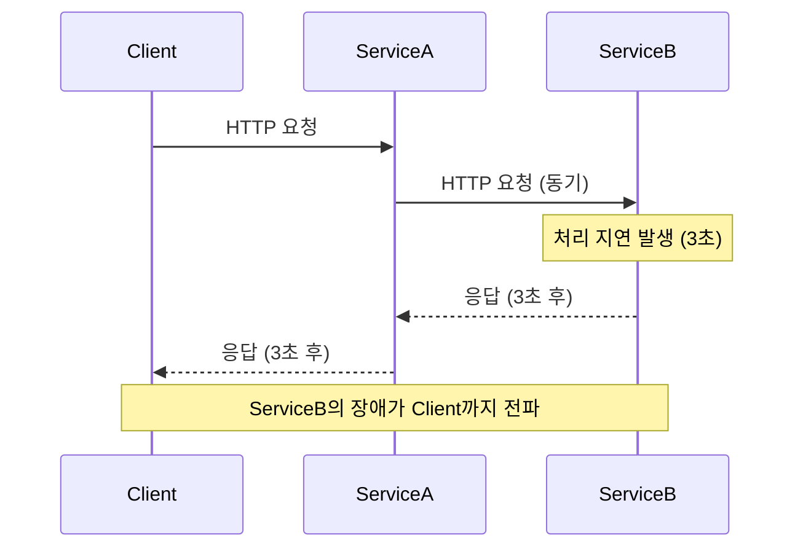
```mermaid
sequenceDiagram
    participant Client
    participant ServiceA
    participant ServiceB

    Client->>ServiceA: HTTP 요청
    ServiceA->>ServiceB: HTTP 요청 (동기)
    Note over ServiceB: 처리 지연 발생 (3초)
    ServiceB-->>ServiceA: 응답 (3초 후)
    ServiceA-->>Client: 응답 (3초 후)
    Note over Client,ServiceB: ServiceB의 장애가 Client까지 전파
```

메시지 큐는 이 결합을 끊는 **비동기 버퍼** 역할을 한다. 발행자는 큐에 메시지를 넣고 즉시 다음 작업으로 넘어갑니다. 소비자는 자신의 속도에 맞게 처리한다.

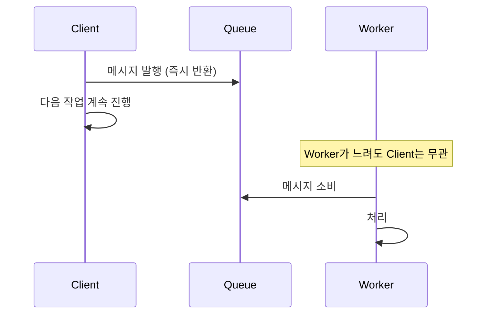
```mermaid
sequenceDiagram
    participant Client
    participant Queue
    participant Worker

    Client->>Queue: 메시지 발행 (즉시 반환)
    Client->>Client: 다음 작업 계속 진행

    Note over Worker: Worker가 느려도 Client는 무관
    Worker->>Queue: 메시지 소비
    Worker->>Worker: 처리
```

### 기존 브로커의 숨겨진 비용

Kafka나 RabbitMQ는 강력하지만, 운영 측면에서 보이지 않는 비용이 발생합니다.

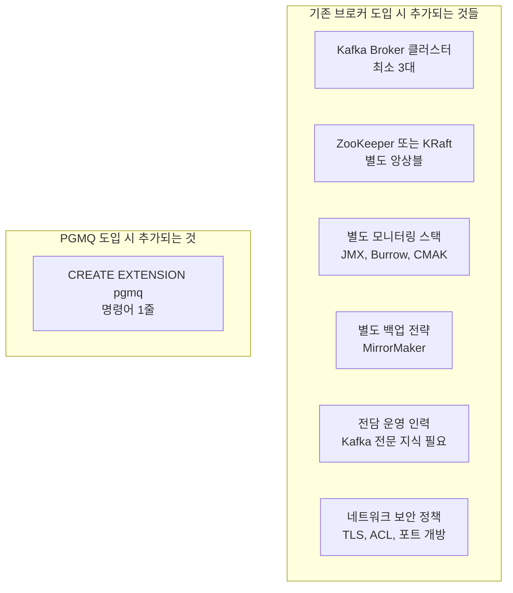
```mermaid
graph TD
    subgraph 기존 브로커 도입 시 추가되는 것들
        B1[Kafka Broker 클러스터<br/>최소 3대]
        B2[ZooKeeper 또는 KRaft<br/>별도 앙상블]
        B3[별도 모니터링 스택<br/>JMX, Burrow, CMAK]
        B4[별도 백업 전략<br/>MirrorMaker]
        B5[전담 운영 인력<br/>Kafka 전문 지식 필요]
        B6[네트워크 보안 정책<br/>TLS, ACL, 포트 개방]
    end

    subgraph PGMQ 도입 시 추가되는 것
        P1[CREATE EXTENSION pgmq<br/>명령어 1줄]
    end
```

더 심각한 문제는 **정합성 문제다**. DB 업데이트와 브로커 발행은 서로 다른 시스템이기 때문에 하나의 트랜잭션으로 묶을 수 없다.

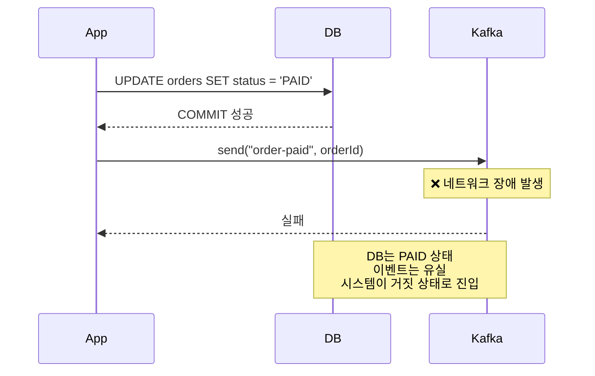
```mermaid
sequenceDiagram
    participant App
    participant DB
    participant Kafka

    App->>DB: UPDATE orders SET status = 'PAID'
    DB-->>App: COMMIT 성공

    App->>Kafka: send("order-paid", orderId)
    Note over Kafka: ❌ 네트워크 장애 발생
    Kafka-->>App: 실패

    Note over DB,Kafka: DB는 PAID 상태<br/>이벤트는 유실<br/>시스템이 거짓 상태로 진입
```

---

## 2. PGMQ의 설계 철학

### 단일 진실 공급원 (SSOT)

PGMQ의 핵심 아이디어는 간단하다. **메시지 삽입을 비즈니스 트랜잭션의 일부로 만드는 것이다**. 큐 테이블이 일반 PostgreSQL 테이블이기 때문에, 동일한 트랜잭션 안에서 비즈니스 데이터와 메시지를 함께 쓸 수 있다.

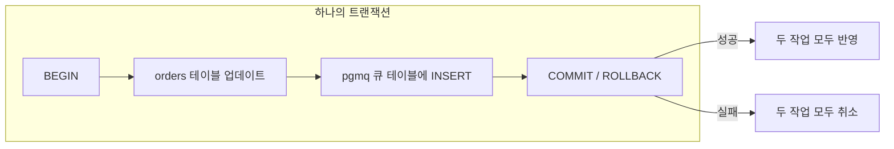
```mermaid
graph LR
    subgraph 하나의 트랜잭션
        direction TB
        A[BEGIN]
        B[orders 테이블 업데이트]
        C[pgmq 큐 테이블에 INSERT]
        D[COMMIT / ROLLBACK]

        A --> B --> C --> D
    end

    D -->|성공| E[두 작업 모두 반영]
    D -->|실패| F[두 작업 모두 취소]

```

이것이 PGMQ가 외부 브로커와 근본적으로 다른 부분이다. 별도의 분산 트랜잭션 프로토콜(2PC)이나 Saga 패턴 없이도 **100% 데이터-이벤트 정합성을 보장할 수 있다.**

### MVI(Minimum Viable Infrastructure) 철학

PostgreSQL은 이미 다양한 Extension으로 수많은 기능을 담당할 수 있으며 PGMQ도 그 중 하나다.

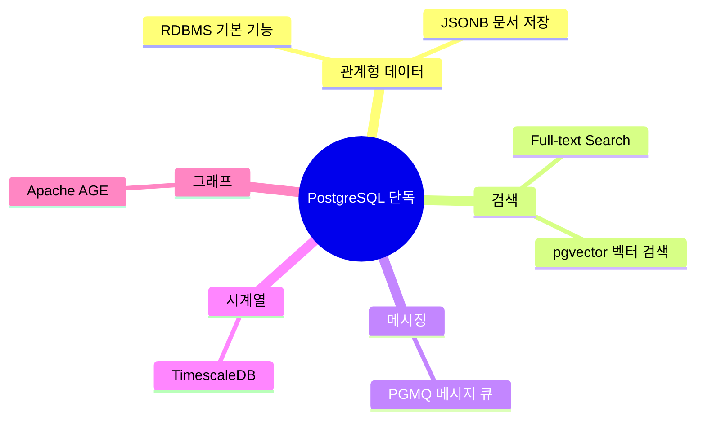
```mermaid
mindmap
  root((PostgreSQL 단독))
    관계형 데이터
      RDBMS 기본 기능
      JSONB 문서 저장
    검색
      Full-text Search
      pgvector 벡터 검색
    메시징
      PGMQ 메시지 큐
    시계열
      TimescaleDB
    그래프
      Apache AGE
```

유지보수 포인트가 하나로 줄어든다는 것은 백업, 보안 패치, 모니터링, 온콜 대응 범위가 모두 단일화된다는 뜻이다.

---

## 3. 내부 구조: 테이블과 메시지 상태

### 큐를 구성하는 두 테이블

`pgmq.create('my_queue')`를 실행하면 두 개의 테이블이 생성된다.- 

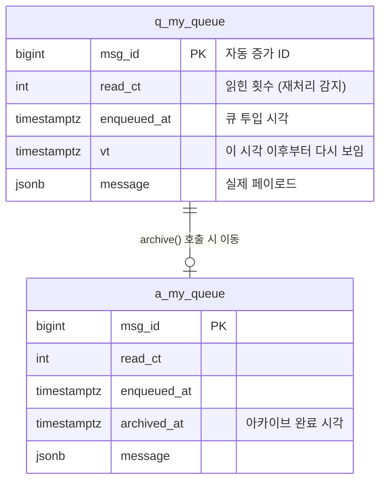
```mermaid
erDiagram
    q_my_queue {
        bigint msg_id PK "자동 증가 ID"
        int read_ct "읽힌 횟수 (재처리 감지)"
        timestamptz enqueued_at "큐 투입 시각"
        timestamptz vt "이 시각 이후부터 다시 보임"
        jsonb message "실제 페이로드"
    }

    a_my_queue {
        bigint msg_id PK
        int read_ct
        timestamptz enqueued_at
        timestamptz archived_at "아카이브 완료 시각"
        jsonb message
    }

    q_my_queue ||--o| a_my_queue : "archive() 호출 시 이동"
```

- `q_` 테이블은 현재 처리 대기 중이거나 처리 중인 **활성 메시지**를 담는다
- `a_` 테이블은 처리 완료 후 `archive()`로 이동된 메시지를 보관하며, 감사 로그나 재처리 분석에 활용된다

`q_` 테이블의  `vt (visibility timeout)` 컬럼이 핵심이다.  "이 시각이 지나야 이 메시지가 다른 컨슈머에게 보인다"는 것을 의미하며, 컨슈머가 메시지를 읽으면 `vt`를 미래 시간으로 변경해 일시적으로 숨기는 방식으로 중복 처리를 방지한다.

`read_ct`는 메시지가 몇 번 읽혔는지를 추적한다. 이 값이 계속 올라간다는 것은 처리는 시도되고 있지만 계속 실패하고 있다는 신호이며, 일정 횟수를 초과하면 Dead Letter Queue(DLQ)로 이동시키는 것이 일반적인 패턴이다.

### 메시지의 전체 생명주기

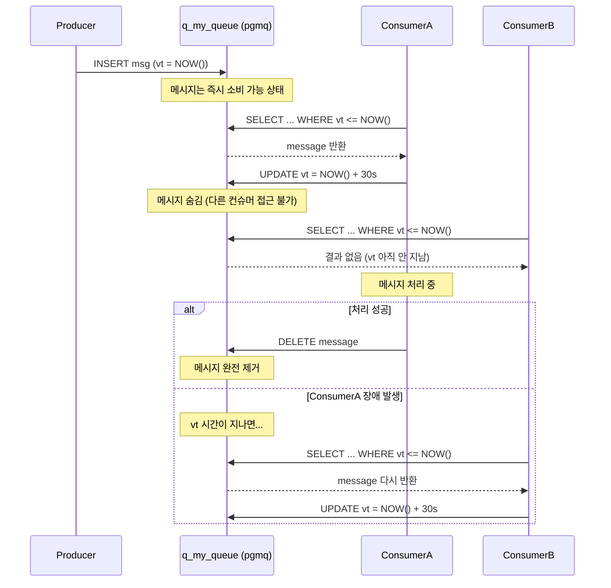
```mermaid
sequenceDiagram
    participant Producer
    participant DB as q_my_queue (pgmq)
    participant ConsumerA
    participant ConsumerB

    Producer->>DB: INSERT msg (vt = NOW())

    Note over DB: 메시지는 즉시 소비 가능 상태

    ConsumerA->>DB: SELECT ... WHERE vt <= NOW()
    DB-->>ConsumerA: message 반환

    ConsumerA->>DB: UPDATE vt = NOW() + 30s
    Note over DB: 메시지 숨김 (다른 컨슈머 접근 불가)

    ConsumerB->>DB: SELECT ... WHERE vt <= NOW()
    DB-->>ConsumerB: 결과 없음 (vt 아직 안 지남)

    Note over ConsumerA: 메시지 처리 중

    alt 처리 성공
        ConsumerA->>DB: DELETE message
        Note over DB: 메시지 완전 제거
    else ConsumerA 장애 발생
        Note over DB: vt 시간이 지나면...
        ConsumerB->>DB: SELECT ... WHERE vt <= NOW()
        DB-->>ConsumerB: message 다시 반환
        ConsumerB->>DB: UPDATE vt = NOW() + 30s
    end
```

---

## 4. 핵심 메커니즘: SKIP LOCKED

### 전통적인 락의 문제

여러 컨슈머가 동시에 같은 큐에서 메시지를 가져가려 할 때, 전통적인 `SELECT FOR UPDATE`는 문제를 발생시킨다.

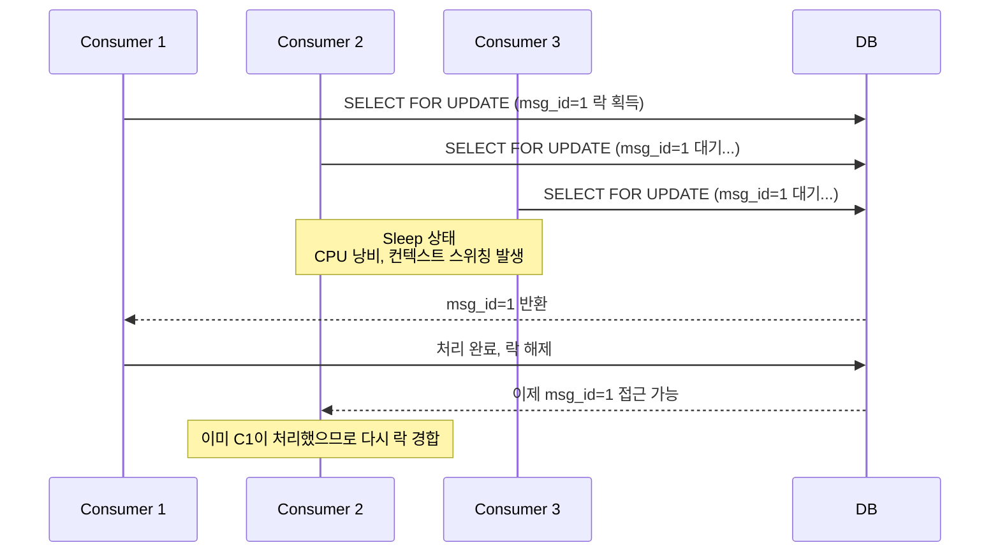
```mermaid
sequenceDiagram
    participant C1 as Consumer 1
    participant C2 as Consumer 2
    participant C3 as Consumer 3
    participant DB

    C1->>DB: SELECT FOR UPDATE (msg_id=1 락 획득)
    C2->>DB: SELECT FOR UPDATE (msg_id=1 대기...)
    C3->>DB: SELECT FOR UPDATE (msg_id=1 대기...)

    Note over C2,C3: Sleep 상태<br/>CPU 낭비, 컨텍스트 스위칭 발생

    DB-->>C1: msg_id=1 반환
    C1->>DB: 처리 완료, 락 해제

    DB-->>C2: 이제 msg_id=1 접근 가능
    Note over C2: 이미 C1이 처리했으므로 다시 락 경합
```

### SKIP LOCKED의 동작 방식

`FOR UPDATE SKIP LOCKED`는 락이 걸린 행을 **기다리지 않고 즉시 건너뛴다**.

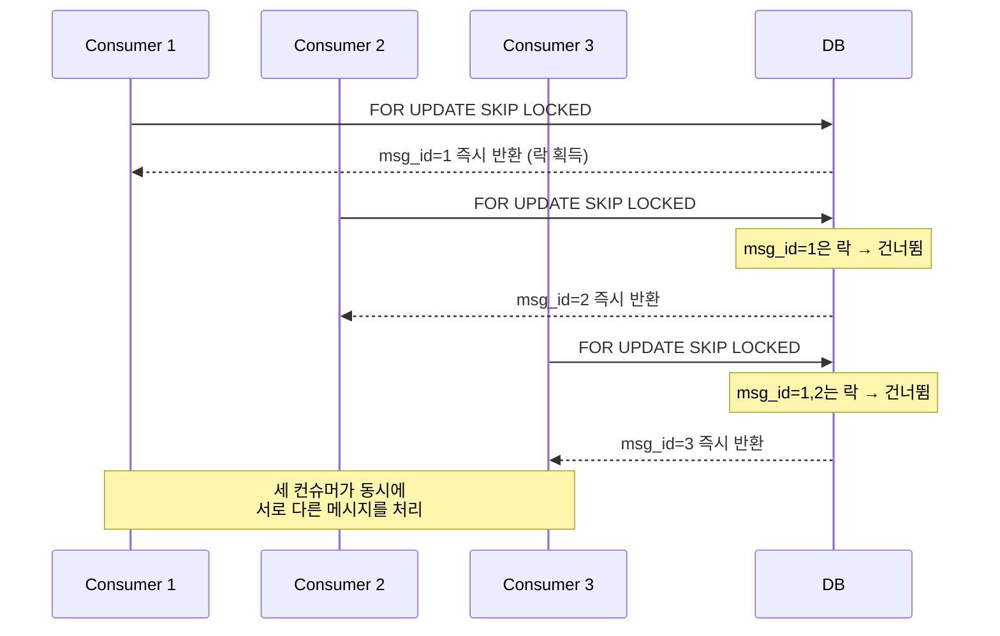
```mermaid
sequenceDiagram
    participant C1 as Consumer 1
    participant C2 as Consumer 2
    participant C3 as Consumer 3
    participant DB

    C1->>DB: FOR UPDATE SKIP LOCKED
    DB-->>C1: msg_id=1 즉시 반환 (락 획득)

    C2->>DB: FOR UPDATE SKIP LOCKED
    Note over DB: msg_id=1은 락 → 건너뜀
    DB-->>C2: msg_id=2 즉시 반환

    C3->>DB: FOR UPDATE SKIP LOCKED
    Note over DB: msg_id=1,2는 락 → 건너뜀
    DB-->>C3: msg_id=3 즉시 반환

    Note over C1,C3: 세 컨슈머가 동시에<br/>서로 다른 메시지를 처리
```

이 방식 덕분에 락 대기 큐가 사용되지 않고, CPU는 순수하게 데이터 탐색에만 집중된니다. 컨슈머를 수평으로 늘리기만 하면 처리량이 선형적으로 증가한다.

---

## 5. 성능 - Table Bloat와 Autovacuum

### Dead Tuple이 생성되는 이유

PostgreSQL의 MVCC 구조상, `UPDATE`와 `DELETE`는 기존 행을 즉시 지우지 않고 기존 행을 **논리적으로 무효화**(xmax 설정)하는 방법을 사용해 물리적 공간은 그대로 남겨둔다. 이 무효화된 행을 **Dead Tuple**이라고 부른다.

큐 테이블은 일반 테이블과 달리 INSERT, UPDATE(read 시), DELETE(archive 시)가 극도로 빈번하다.

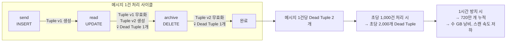
```mermaid
graph LR
    subgraph "메시지 1건 처리 사이클"
        S[send<br/>INSERT] -->|Tuple v1 생성| R[read<br/>UPDATE]
        R -->|Tuple v1 무효화<br/>Tuple v2 생성<br/>💀 Dead Tuple 1개| A[archive<br/>DELETE]
        A -->|Tuple v2 무효화<br/>💀 Dead Tuple 1개| E[완료]
    end

    E --> F["메시지 1건당 Dead Tuple 2개"]
    F --> G["초당 1,000건 처리 시<br/>→ 초당 2,000개 Dead Tuple"]
    G --> H["1시간 방치 시<br/>→ 720만 개 누적<br/>→ 수 GB 낭비, 스캔 속도 저하"]

   
```

### Autovacuum

Autovacuum은 Dead Tuple을 주기적으로 청소하여 공간을 재사용 가능한 상태로 만드는 백그라운드 프로세스이다.

Autovacuum이 따라가지 못하면 테이블이 점점 비대해지고(Table Bloat), 인덱스 스캔이 불필요한 Dead Tuple 페이지를 읽으며 성능이 저하된다. 따라서 큐 테이블에는 반드시 **공격적인 Autovacuum 설정**이 필요해진다.

---

## 6. 도메인 적합성: 어디에 써야 하는가

PGMQ가 기술적으로 **최선의 선택**이 되는 시나리오다.

### Transactional Outbox 패턴

MSA에서 서비스 간 이벤트 전달의 핵심 과제는 DB 업데이트와 이벤트 발행의 원자성 보장이다. 전통적인 Outbox 패턴은 별도 테이블과 폴링 스케줄러가 필요하지만, PGMQ는 이를 단순화할 수 있다.

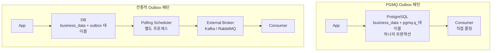
```mermaid
graph TD

    subgraph "PGMQ Outbox 패턴"
        A2[App] --> B2[PostgreSQL<br/>business_data + pgmq.q_테이블<br/>하나의 트랜잭션]
        B2 --> E2[Consumer<br/>직접 폴링]
    end
    
    subgraph "전통적 Outbox 패턴"
        A1[App] --> B1[DB<br/>business_data + outbox 테이블]
        B1 --> C1[Polling Scheduler<br/>별도 프로세스]
        C1 --> D1[External Broker<br/>Kafka / RabbitMQ]
        D1 --> E1[Consumer]
    end

```

**적합 도메인**: 이커머스 주문 처리, 물류 상태 변경, 결제 완료 알림

### 금융 및 결제 시스템

메시지 유실이 곧 금전적 손실인 도메인이다. PGMQ는 PostgreSQL의 WAL 기반 내구성을 그대로 상속는다.

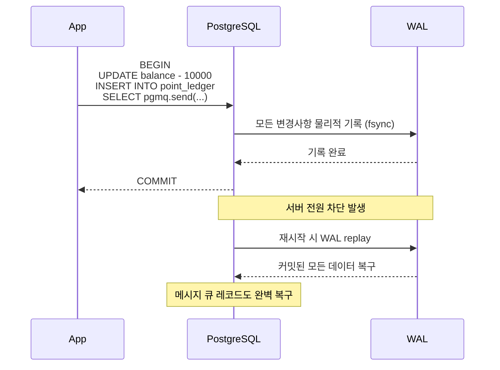
```mermaid
sequenceDiagram
    participant App
    participant PostgreSQL
    participant WAL

    App->>PostgreSQL: BEGIN<br/>UPDATE balance - 10000<br/>INSERT INTO point_ledger<br/>SELECT pgmq.send(...)

    PostgreSQL->>WAL: 모든 변경사항 물리적 기록 (fsync)
    WAL-->>PostgreSQL: 기록 완료

    PostgreSQL-->>App: COMMIT

    Note over PostgreSQL,WAL: 서버 전원 차단 발생

    PostgreSQL->>WAL: 재시작 시 WAL replay
    WAL-->>PostgreSQL: 커밋된 모든 데이터 복구
    Note over PostgreSQL: 메시지 큐 레코드도 완벽 복구
```

**적합 도메인**: 포인트 적립/차감, 쿠폰 발급, 계좌 이체 알림, 정산 배치

### 다단계 상태 전이 워크플로우

처리 로직이 DB 데이터와 긴밀하게 연동되어야 하는 복잡한 워크플로우

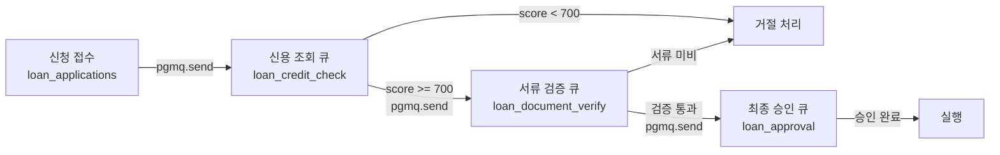
```mermaid
graph LR
    A[신청 접수<br/>loan_applications] -->|pgmq.send| B[신용 조회 큐<br/>loan_credit_check]
    B -->|score >= 700<br/>pgmq.send| C[서류 검증 큐<br/>loan_document_verify]
    B -->|score < 700| F[거절 처리]
    C -->|검증 통과<br/>pgmq.send| D[최종 승인 큐<br/>loan_approval]
    C -->|서류 미비| F
    D -->|승인 완료| E[실행]
```

외부 브로커에서는 이 라우팅 로직을 구현하려면 별도의 Saga Orchestrator나 Choreography 패턴이 필요하지만 PGMQ에서는 DB 내 데이터를 직접 조회하며 라우팅할 수 있다.

**적합 도메인**: 대출 심사, 콘텐츠 검수, 내부 결재 프로세스, 계약서 승인

### 비동기 알림 및 Job Queue

발송 실패가 비즈니스 로직에 영향을 주지 않아야 하고, 재시도가 필요한 작업들

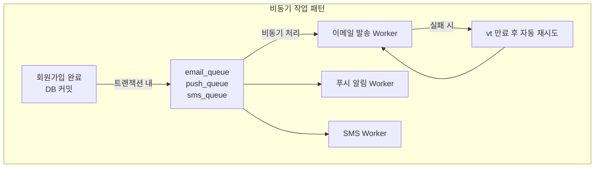
```mermaid
graph TD
    subgraph "비동기 작업 패턴"
        A[회원가입 완료<br/>DB 커밋] -->|트랜잭션 내| B[email_queue<br/>push_queue<br/>sms_queue]
        B -->|비동기 처리| C[이메일 발송 Worker]
        B --> D[푸시 알림 Worker]
        B --> E[SMS Worker]

        C -->|실패 시| F[vt 만료 후 자동 재시도]
        F --> C
    end
```

**적합 도메인**: 이메일/SMS 발송, 푸시 알림, Webhook 전송, 리포트 생성, 이미지 처리

---

## 7. PGMQ가 적합하지 않은 시나리오

### 초고처리량 스트리밍

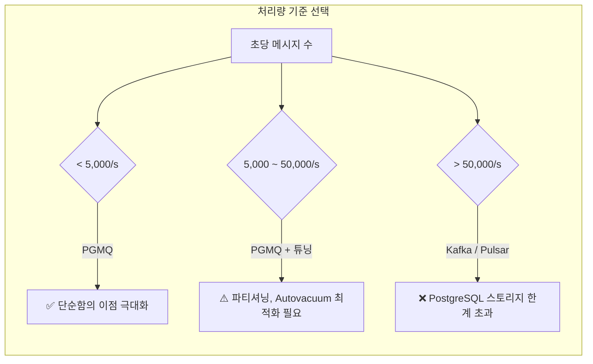
```mermaid
graph LR
    subgraph "처리량 기준 선택"
        A --> D{> 50,000/s}
        A --> C{5,000 ~ 50,000/s}
        A[초당 메시지 수] --> B{< 5,000/s}

        B -->|PGMQ| E[✅ 단순함의 이점 극대화]
        C -->|PGMQ + 튜닝| F[⚠️ 파티셔닝, Autovacuum 최적화 필요]
        D -->|Kafka / Pulsar| G[❌ PostgreSQL 스토리지 한계 초과]
    end
```

실시간 로그 수집, IoT 센서 스트리밍, 광고 클릭 스트림처럼 초당 수십만 건 이상이 지속적으로 발생하는 환경에서는 Kafka가 필요해진다.

### 멀티 컨슈머 팬아웃 (Pub/Sub)

하나의 메시지를 여러 구독자가 각자 독립적으로 소비해야 하는 패턴

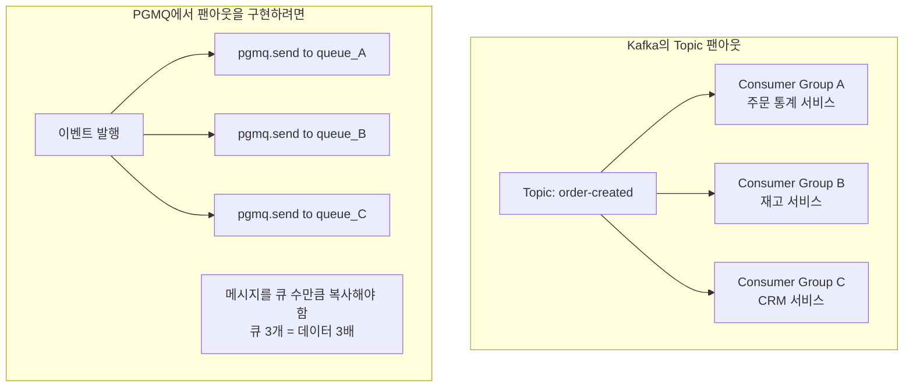
```mermaid
graph TD
    subgraph "Kafka의 Topic 팬아웃"
        K[Topic: order-created] --> K1[Consumer Group A<br/>주문 통계 서비스]
        K --> K2[Consumer Group B<br/>재고 서비스]
        K --> K3[Consumer Group C<br/> CRM 서비스]
    end

    subgraph "PGMQ에서 팬아웃을 구현하려면"
        P[이벤트 발행] --> P1[pgmq.send to queue_A]
        P --> P2[pgmq.send to queue_B]
        P --> P3[pgmq.send to queue_C]
        Note1[메시지를 큐 수만큼 복사해야 함<br/>큐 3개 = 데이터 3배]
    end

```

### 이벤트 소싱과 스트림 리플레이

Kafka는 메시지를 영구 보존하고 Consumer가 원하는 오프셋으로 되돌아가 전체 이력을 재처리할 수 있다. PGMQ도 아카이브 테이블로 조회는 가능하지만, 파티션 기반 병렬 리플레이나 오프셋 관리 기능은 없다.

---

## 8. 운영 전략: 파티셔닝과 모니터링

### 아카이브 테이블 파티셔닝

처리 완료된 메시지가 `a_` 테이블에 계속 쌓이면 조회 성능이 저하된다. 날짜별 파티셔닝으로 오래된 데이터를 효율적으로 관리할 수 있다.

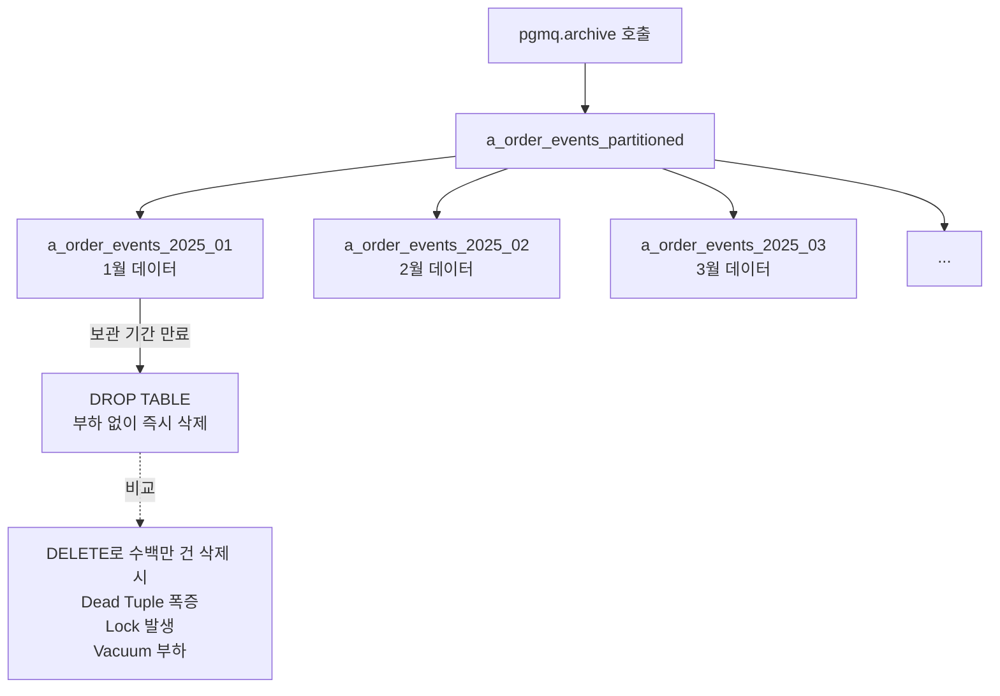
```mermaid
graph TD
    A[pgmq.archive 호출] --> B[a_order_events_partitioned]

    B --> C[a_order_events_2025_01<br/>1월 데이터]
    B --> D[a_order_events_2025_02<br/>2월 데이터]
    B --> E[a_order_events_2025_03<br/>3월 데이터]
    B --> F[...]

    C -->|보관 기간 만료| G[DROP TABLE<br/>부하 없이 즉시 삭제]

    G -.->|비교| H[DELETE로 수백만 건 삭제 시<br/>Dead Tuple 폭증<br/>Lock 발생<br/>Vacuum 부하]
```

`DROP TABLE`은 데이터를 한 건씩 삭제하지 않고 파일 자체를 제거하므로, Dead Tuple 발생 없이 즉각적으로 공간을 회수합니다.

### Dead Letter Queue(DLQ) 패턴

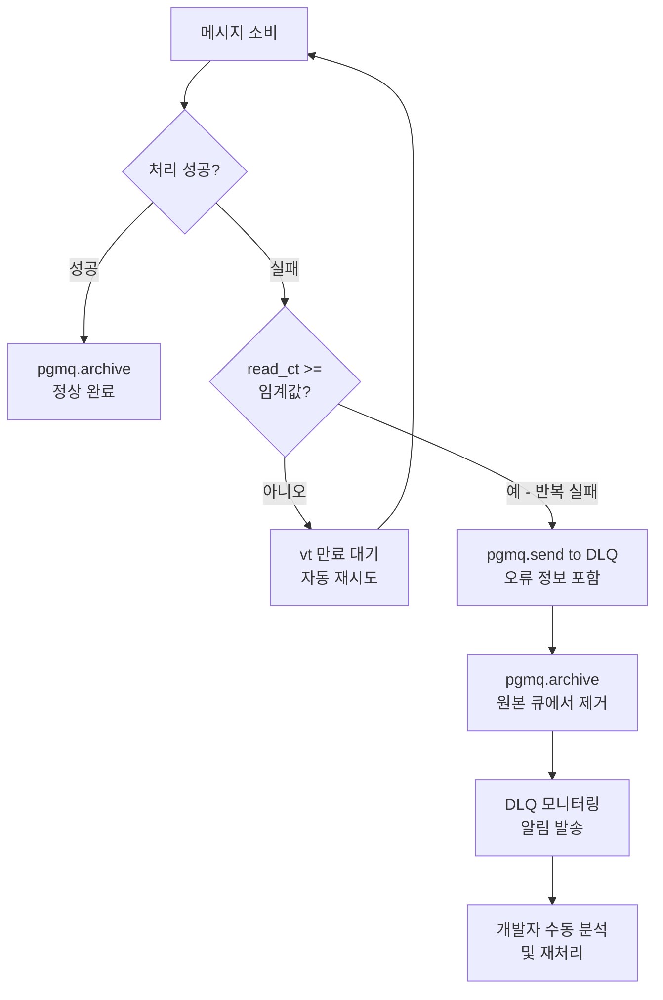
```mermaid
graph TD
    A[메시지 소비] --> B{처리 성공?}

    B -->|성공| C[pgmq.archive<br/>정상 완료]

    B -->|실패| D{read_ct >=<br/>임계값?}

    D -->|아니오| E[vt 만료 대기<br/>자동 재시도]
    E --> A

    D -->|예 - 반복 실패| F[pgmq.send to DLQ<br/>오류 정보 포함]
    F --> G[pgmq.archive<br/>원본 큐에서 제거]

    G --> H[DLQ 모니터링<br/>알림 발송]
    H --> I[개발자 수동 분석<br/>및 재처리]
```

### 핵심 모니터링 지표

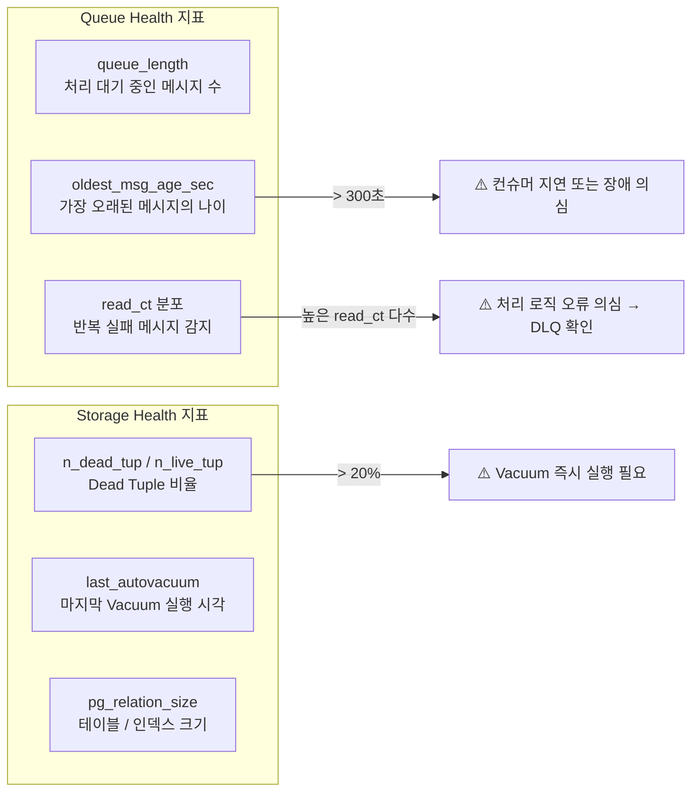
```mermaid
graph LR
    subgraph "Queue Health 지표"
        M1[queue_length<br/>처리 대기 중인 메시지 수]
        M2[oldest_msg_age_sec<br/>가장 오래된 메시지의 나이]
        M3[read_ct 분포<br/>반복 실패 메시지 감지]
    end

    subgraph "Storage Health 지표"
        S1[n_dead_tup / n_live_tup<br/>Dead Tuple 비율]
        S2[last_autovacuum<br/>마지막 Vacuum 실행 시각]
        S3[pg_relation_size<br/>테이블 / 인덱스 크기]
    end

    M2 -->|> 300초| A1[⚠️ 컨슈머 지연 또는 장애 의심]
    M3 -->|높은 read_ct 다수| A2[⚠️ 처리 로직 오류 의심 → DLQ 확인]
    S1 -->|> 20%| A3[⚠️ Vacuum 즉시 실행 필요]
```

---

####  참고 자료

- [pgmq](https://pgmq.github.io/pgmq/latest/)
- [사내 메시지큐 기술 스택 전환 kafka -> PGMA](https://programmer-may.tistory.com/262)
- [관련 유튜브 (좋다고 홍보하는 외국 아재들) 요약](https://lilys.ai/digest/9135209/10555711?s=1&noteVersionId=7058901)